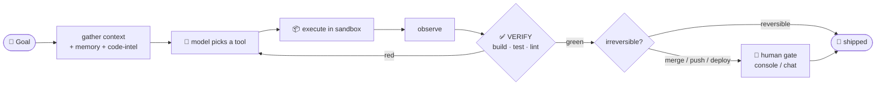
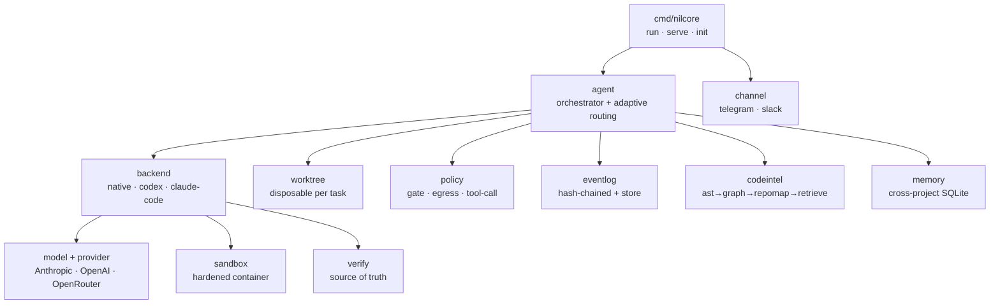

<div align="center">

# ⬡ NilCore

### The tiny, trustworthy coding agent.

**The harness is small. The model is the engine.**
NilCore borrows intelligence instead of re‑encoding it — so the whole agent is **~8,100 lines of Go** you can actually hold in your head, hardened by three disciplines and seven invariants it never breaks.

[](https://github.com/RNT56/NilCore/actions/workflows/ci.yml)
[](https://github.com/RNT56/NilCore/releases/latest)
[](go.mod)
[-2ea44f)](go.mod)
[](#-the-receipts)
[](#-the-seven-invariants-non-negotiable)

</div>

---

> **TL;DR** — Point NilCore at a repo and a goal. It works in a throwaway git worktree, runs every command in a sandbox, and **isn't done until *your* checks pass** — not until the model *says* it's done. Drive it from your terminal or your phone. It never holds your keys, never runs on the host, and never decides "done" on its own word.

```sh
nilcore -dir ./repo -goal "make the failing test in math_test.go pass"
```

---

## 🤔 Why another coding agent?

Because most of them ask you to trust a black box. NilCore is built on the opposite bet: **trust comes from verification, sandboxing, and a trace you can read — not from a bigger model.** Here's the pain, and how NilCore kills it:

| 😖 The pain you've felt | ⚙️ How NilCore solves it |
|---|---|
| **"It said it was done. It wasn't."** | The **verifier is the only authority on done.** After *any* backend runs, your project's own build/test/lint re‑runs and that verdict ships the work — a self‑report never does. |
| **"It ran a destructive command / touched my host."** | **Everything the model emits runs in a container** (rootless, `cap-drop=ALL`, read‑only rootfs). Destructive commands are denylisted *before* execution. Nothing runs on your machine. |
| **"It leaked my API key."** | Secrets come from the **environment only**, are injected per‑run into the container, and are **never** written to disk, put in a prompt, or logged — the audit log is hash‑chained *and* redacted. |
| **"A fetched file/web page hijacked it."** | **Untrusted input is data, never instructions.** Tool output, files, and web content are fenced behind a boundary the model is told not to obey. |
| **"It edited blindly without understanding my codebase."** | A real **code‑intelligence stack** — AST → call graph → PageRank repo‑map → semantic + LSP retrieval — hands the loop a minimal, structurally‑coherent context bundle *before* it touches a file. |
| **"It went rogue while I was away."** | **Bounded autonomy:** reversible work runs unattended; irreversible actions (merge, push, deploy, pay) hit a **human gate** — which becomes a Yes/No tap in Telegram or Slack. |
| **"I'm locked into one model vendor."** | One `Provider` seam, three adapters: **Anthropic, OpenAI, OpenRouter.** Model selection is `role → provider:model`. The cheap executor escalates to a strong advisor on demand. |
| **"It forgets everything between tasks."** | **Cross‑project memory** (SQLite): conventions and decisions are retrieved into context at task start and written back after — deduped, never as instructions. |
| **"The framework is too big to trust."** | The entire agent is **~8,100 lines of Go with one dependency.** If you can't hold the core in your head, it's too big. |

---

## 🔁 The core loop

Everything orbits one loop. The verifier — *your* checks — is the source of truth.



> Whatever writes the diff — NilCore's own loop, **Codex**, or **Claude Code** — *your* checks decide whether it ships. That single rule is what makes delegating to black‑box agents safe.

---

## ✨ What you get

<table>
<tr>
<td width="50%" valign="top">

**🧩 Hybrid backends, one contract**
Native loop + delegate to Codex / Claude Code. Add one without touching the core.

**🛡️ Hardened sandbox**
Rootless containers, dropped caps, read‑only rootfs, default‑deny egress with an allowlist proxy.

**🔑 Secrets that never leak**
Keychain / encrypted‑file vault / env / external hook. The model never sees a key.

**📡 Drive it from your phone**
`serve` on a VPS; Telegram & Slack. Gates become inline Yes/No.

</td>
<td width="50%" valign="top">

**🧠 Code intelligence**
AST · call graph · PageRank repo‑map · LSP · semantic search · Impact Set + SBFL · live worktree‑aware updates.

**🎛️ Adaptive orchestration**
Plan complex goals → parallel subworkers in isolated worktrees → race best‑of‑N with the **verifier as judge**.

**🧾 Tamper‑evident audit**
Append‑only, hash‑chained, secret‑redacted event log. Replay any run.

**♻️ Runs unattended**
Provider retry/failover, cost ceilings, durable resume on restart, resource GC, health checks.

</td>
</tr>
</table>

---

## 🚀 Quickstart

**Requires** Go 1.25+ and a container runtime (`podman` rootless preferred, or `docker`).

```sh
# Install (or grab a binary from Releases)
curl -fsSL https://raw.githubusercontent.com/RNT56/NilCore/main/scripts/install.sh | sh

export ANTHROPIC_API_KEY=sk-...

# 1) Run one task to completion (the native loop, in a disposable worktree)
nilcore -dir ./repo \
        -goal "fix the failing test in math_test.go" \
        -verify "go build ./... && go test ./..."

# 2) Delegate the same task to Claude Code or Codex — verified the same way
nilcore -dir ./repo -goal "..." -backend claude-code
nilcore -dir ./repo -goal "..." -backend codex

# 3) Drive it from your phone: gates become chat replies
nilcore serve -channel telegram          # needs TELEGRAM_BOT_TOKEN

# 4) Guided setup (providers, keys → SecretStore, runtime, channel)
nilcore init
```

**Model selection** is `provider:model` via `NILCORE_MODEL` (default `claude-sonnet-4-6`; a bare name → Anthropic, e.g. `openai:gpt-5.5`, `openrouter:meta-llama/llama-3.1-70b`).
**Every step** is appended to a hash‑chained `nilcore.events.jsonl` — read it to see exactly what the agent did and why. Secrets come from the environment and never hit disk, logs, or prompts.

---

## 🧭 Our dogma — first principles, ranked by leverage

By 2026 the frontier models inside every serious agent have **converged**. The harness does the rest. NilCore's bet is to be the **best harness** — and "best" is the disciplined application of a short list, not a long list of features.

1. **The feedback loop is the product.** Knowing — truthfully, fast — whether the code works is everything. Verification is the *sole* authority on done.
2. **The harness wins; borrow the intelligence.** Keep the harness small, sharp, and yours; let the model supply the fluency.
3. **Context is the scarce resource — engineer it ruthlessly.** The *right* context beats the biggest window. Retrieve precisely, prune aggressively, summarize on handoff.
4. **Understand before you change.** Navigate symbols, references, and a repo‑map first. Earn the right to edit.
5. **Small, reversible, verified steps.** One change → verify → checkpoint. Reversible by construction, so the gate concentrates only where reversibility ends.
6. **Define "done" before you start.** Acceptance criteria — ideally a failing test — first. The best defense against confidently building the wrong thing.
7. **Quality is the bar, not correctness.** Green is the floor. A minimal, idiomatic diff a senior would approve is the bar.
8. **Recover, don't thrash.** Recognize being stuck and change strategy — escalate to the advisor, or stop and ask one sharp question.
9. **Earn improvement from evidence.** Tune from evals and the audit trail, not vibes.
10. **Safety is what makes autonomy possible.** The sandbox, the gate, the audit, and no ambient authority aren't friction — they're *why* the agent can be trusted to run unattended.

> *Anti‑principles we refuse:* reaching for a bigger model instead of a better harness · stuffing the context window "to be safe" · heroic one‑shot rewrites · trusting "it works" over a check · editing before understanding · optimizing on vibes · bolting on features that dilute the core.

---

## 🔒 The seven invariants (non‑negotiable)

These hold in every commit. Break one and the change is rejected — no matter how good the rest is.

1. **One frozen backend contract** — `Run(ctx, Task) (Result, error)`. Native, Codex, Claude Code are interchangeable behind it.
2. **The verifier is the only authority on "done."** A self‑report never governs.
3. **No ambient authority.** Secrets via env only; never on disk, in logs, in prompts, or in code.
4. **All execution is sandboxed.** Nothing the model emits runs on the host.
5. **The audit log is append‑only** — hash‑chained, redacted, replayable. History is never mutated.
6. **Zero‑dependency core** — standard library only. (SQLite, pure‑Go, is the single sanctioned exception.)
7. **Untrusted input is data, never instructions.**

---

## 🏗️ Architecture at a glance



Dependencies point inward; leaf packages never import the orchestrator. The full design and rationale live in [`docs/ARCHITECTURE.md`](docs/ARCHITECTURE.md) and [`docs/PRINCIPLES.md`](docs/PRINCIPLES.md).

---

## 📊 The receipts

<div align="center">

| | |
|--:|:--|
| **~8,100** | lines of Go — *the agent itself* |
| ~14,000 | lines including its tests (58 test files) |
| **46** | small, single‑responsibility packages |
| **1** | external dependency (pure‑Go SQLite) |
| **7 / 7** | invariants held |
| **56 / 56** | build tasks shipped (Phases 0–6) · `v0.1.0` |

</div>

Built one verified‑green commit at a time — `make verify` + lint passing on every push, in CI. The wide independent layers (the 8‑package code‑intelligence stack, the 7 runtime‑ops packages) were drafted by parallel agents and integrated under the same green gate.

---

## 📦 What's inside

```text
cmd/nilcore/           run · serve · init
internal/
  model, provider      canonical message format + Anthropic/OpenAI/OpenRouter
  backend              CodingBackend contract + native / codex / claude-code
  sandbox              hardened container executor
  verify               the source of truth for "done" (+ auto-detection)
  eventlog             append-only, hash-chained, redacted audit trail
  policy               reversibility gate · egress allowlist · tool-call denylist
  agent                orchestrator · routing · spawn · durability
  worktree             disposable git worktree per task
  channel              Channel contract · telegram · slack · authorized control
  tools, mcp           structured tools + MCP-as-code
  codeintel/*          ast · graph · repomap · lsp · semantic · retrieve · impact · live
  store, memory        SQLite backbone + cross-project memory
  secrets              keychain / encrypted vault / env / external
  skills, selfimprove  Agent Skills + plugins + gated self-edit
  budget, scheduler, maint, inspect, config   runtime resilience & ops
eval/                  measure-first eval harness
```

---

## 🩺 Status

**Shipped — `v0.1.0`.** All 56 tasks of the build plan ([`docs/TASKS.md`](docs/TASKS.md)) are complete across Phases 0–6: the verifying, sandboxed, bounded core that plans, parallelizes across three backends, understands code structurally, remembers across projects, and improves itself under a human gate — running unattended with authorized control, metered budgets, durable resumption, and bounded resources.

---

<div align="center">

**No ambient authority. One loop, fully observable. You can always read the trace and pull the plug.**

*Borrow intelligence — don't reimplement it.*

</div>
