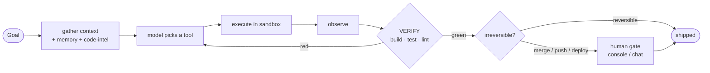
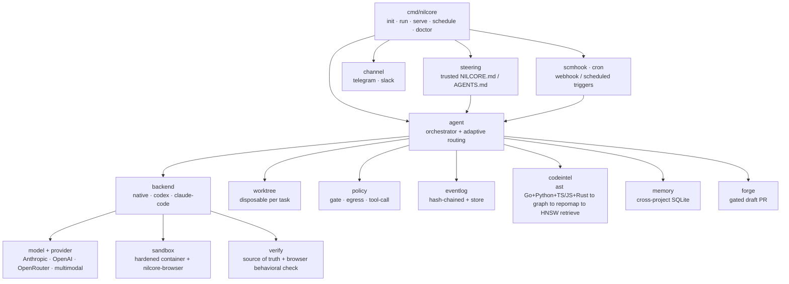

<div align="center">


### The tiny, trustworthy coding agent.

**The harness is small. The model is the engine.**
NilCore borrows intelligence instead of re‑encoding it — so the whole agent is **~30,800 lines of Go** you can read end to end: a ~8k single‑task core, an opt‑in **multi‑agent supervisor** that builds whole projects, and **one conversational front door** you just talk to. It can now **see the running app** through a sandboxed browser — even driving a flow (log in, submit a form) before it observes — search code semantically, read Go, Python, TypeScript/JavaScript *and* Rust, and start work from a webhook or a schedule. Hardened by three disciplines and seven invariants it never breaks.

[](https://github.com/RNT56/NilCore/actions/workflows/ci.yml)
[](https://github.com/RNT56/NilCore/releases/latest)
[](go.mod)
[](go.mod)
[](#the-receipts)
[](#the-seven-invariants-non-negotiable)

</div>

---

> **TL;DR** — Point NilCore at a repo and a goal. It works in a throwaway git worktree, runs every command the model emits inside a sandbox, and **isn't done until *your* checks pass** — not until the model *says* it's done. Drive it from your terminal or your phone. It never holds your keys, never lets the model run an arbitrary program on the host, and never decides "done" on its own word.

```sh
nilcore                       # just start talking — it picks the machine and works while you type
nilcore -goal "make the failing test in math_test.go pass"   # or drive one task headless
```

---

## Why another coding agent?

Because most of them ask you to trust a black box. NilCore is built on the opposite bet: **trust comes from verification, sandboxing, and a trace you can read — not from a bigger model.** Here's the pain, and how NilCore kills it:

| The pain you've felt | How NilCore solves it |
|---|---|
| **"It said it was done. It wasn't."** | The **verifier is the only authority on done.** After *any* backend runs, your project's own build/test/lint re‑runs and that verdict ships the work — a self‑report never does. |
| **"Tests pass, but does the app actually *work*?"** | NilCore can **see the running app.** A sandboxed headless browser (`browser_view` + a pure‑Go `nilcore-browser` driver baked into the image) navigates your app — and, given an `actions` script, first **drives a flow** (click / type / key / wait, e.g. log in or submit a form) over a pure‑Go CDP client — then hands the model a **screenshot as a multimodal image**; opt‑in via `NILCORE_BROWSER_VERIFY`, a composite verifier folds that behavioral check *into* the verdict, so the verifier stays the sole authority on done. *(The live browser run is CI‑only — no Chromium in hermetic unit tests — and the driver fails **closed** without a browser.)* |
| **"It ran a destructive command / touched my host."** | **Every command the model emits runs in a container** (rootless, `cap-drop=ALL`, read‑only rootfs), destructive ones denylisted *before* execution. The model can't run an arbitrary program on your machine; its file edits are confined to a throwaway worktree. |
| **"It leaked my API key."** | Secrets come from the **environment only**, are injected per‑run into the container, and are **never** written to disk, put in a prompt, or logged — the audit log is hash‑chained *and* redacted. |
| **"A fetched file/web page hijacked it."** | **Untrusted input is data, never instructions.** Tool output, files, and web content are fenced behind a boundary the model is told not to obey. |
| **"It edited blindly without understanding my codebase."** | A real **code‑intelligence stack** — AST → call graph → PageRank repo‑map → semantic + LSP retrieval — hands the loop a minimal, structurally‑coherent context bundle *before* it touches a file. It reads **Go, Python, TypeScript/JavaScript *and* Rust** (a pure‑Go parser seam — heuristic line scanners, no tree‑sitter; the `NILCORE_LSP_COMMAND` seam stays the precise lens), and semantic search runs on a content‑hash‑cached, pure‑Go **HNSW** vector index — opt‑in via `NILCORE_EMBED_KEY`, with a lexical fallback that's byte‑identical when it's off. |
| **"It can only fix one task, not *build the thing*."** | `nilcore build` is a **supervisor that spawns role‑specialized subagents** (research · understand · plan · implement · review), lets them **talk back and forth**, **integrates** their parallel worktrees into one **verifier‑green** tree, and **re‑plans to convergence** — greenfield included. It still writes code itself. |
| **"I have to babysit it / can't course‑correct mid‑run."** | **Just talk to it.** `nilcore chat` is one conversation — it infers whether your message is a quick fix, a feature, or a whole project and pulls the strings itself. While it works its reasoning **streams live, token by token**, and you can **queue** a follow‑up (folds in at the next step), **steer** — `!…` **interrupts mid‑thought but keeps** what it's reasoned so far, folds your feedback in, and resumes or changes course — or `/cancel` to abort the run outright while staying in the conversation. |
| **"It went rogue while I was away."** | **Bounded autonomy:** reversible work runs unattended; irreversible actions (merge, push, deploy, pay) hit a **human gate** — which becomes a Yes/No tap in Telegram or Slack. |
| **"I want it to *react* — not just sit there waiting for me."** | **Event‑driven & scheduled autonomy.** `nilcore serve --webhook` turns an HMAC‑verified SCM/CI webhook into a trigger; `nilcore schedule` self‑starts on a cron/interval. Both route through the *same* reversible‑auto‑start / human‑gate machinery — headless means irreversible work deny‑defaults. |
| **"Opening the PR is the part I don't trust it with."** | **Gated PR.** `nilcore watch --open-pr` / `schedule --open-pr` open a **draft** PR (via `internal/forge`) **only after the human gate** — the push runs inside the approved prepare step, the token comes from the SecretStore and is scrubbed from logs, and **the agent never merges.** The verified branch is preserved; default disposable cleanup is byte‑identical. |
| **"I can't give it project‑specific marching orders."** | **Operator steering.** Drop a `NILCORE.md` / `AGENTS.md` and it loads as **trusted** instructions — the one deliberate, scoped exception to "untrusted input is data," bounded *below* the safety core: it can shape behavior but can't widen capability or bypass the gate or verifier. Wired into chat and run/build. |
| **"I'm locked into one model vendor."** | One `Provider` seam, three adapters: **Anthropic, OpenAI, OpenRouter.** Model selection is `role → provider:model`. The cheap executor escalates to a strong advisor on demand. |
| **"It forgets everything between tasks."** | **Cross‑project memory** (SQLite): conventions and decisions are retrieved into context at task start and written back after — deduped, never as instructions. |
| **"The framework is too big to trust."** | The entire agent is **~30,800 lines of Go with two core dependencies** — pure‑Go SQLite, and `golang.org/x/sys` (Go's own extended stdlib) for the Linux namespace sandbox — over a ~8k single‑task core, a multi‑agent layer, and the conversational front door. *Still exactly two:* the browser driver (incl. its pure‑Go CDP/WebSocket client), the multi‑language parser backends, embedder, and forge are **all pure stdlib** — no module was added. If you can't read it end to end, it's too big. *(The optional full‑screen TUI — `make tui` — links the Charm stack under a build tag, so the default binary doesn't and `internal/` never imports it.)* |

---

## The core loop

Everything orbits one loop. The verifier — *your* checks — is the source of truth.



> Whatever writes the diff — NilCore's own loop, **Codex**, or **Claude Code** — *your* checks decide whether it ships. That single rule is what makes delegating to black‑box agents safe.

---

## What you get

<table>
<tr>
<td width="50%" valign="top">

▸ **Hybrid backends, one contract**
Native loop + delegate to Codex / Claude Code. Add one without touching the core.

▸ **Hardened sandbox**
Rootless containers, dropped caps, read‑only rootfs, default‑deny egress with an allowlist proxy.

▸ **Secrets that never leak**
Keychain / encrypted‑file vault / env / external hook. The model never sees a key.

▸ **Drive it from your phone**
`serve` on a VPS; Telegram & Slack. Gates become inline Yes/No.

▸ **One conversational front door** (`nilcore chat`)
Just talk — it infers quick‑fix vs feature vs whole‑project and acts. Watch its reasoning **stream live**; **queue** a follow‑up, **steer** (`!…`) — it interrupts mid‑thought, keeps the partial reasoning, then resumes or changes — or `/cancel` to abort. Works in the terminal and over Telegram/Slack.

</td>
<td width="50%" valign="top">

▸ **Code intelligence** (Go · Python · TS/JS · Rust)
AST · call graph · PageRank repo‑map · LSP · pure‑Go **HNSW** semantic search · Impact Set + SBFL · live worktree‑aware updates.

▸ **It can see the running app**
A sandboxed headless browser (`browser_view`) can **drive a flow first** (click / type / key / wait — log in, submit a form) over a pure‑Go CDP client, then hands the model a screenshot as a multimodal image; opt‑in, a composite verifier folds the behavioral check into the verdict. *(Live run is CI‑only; fails closed without a browser.)*

▸ **Multi‑agent supervisor** (`nilcore build`)
A supervisor spawns role‑specialized subagents (research · understand · plan · implement · review) that **communicate back and forth**, integrates their parallel worktrees into one **verifier‑green** tree, and re‑plans to convergence. Greenfield‑capable; the supervisor codes, too.

▸ **Tamper‑evident audit**
Append‑only, hash‑chained, secret‑redacted event log. Replay any run.

▸ **Runs unattended — and reacts**
Provider retry/failover, cost ceilings, durable resume on restart, resource GC, health checks. Plus event/scheduled triggers — `serve --webhook` (HMAC‑verified SCM/CI) and `schedule` (cron/interval) — and a gated **draft PR** (`--open-pr`) that opens only after the human gate. The agent never merges.

▸ **Operator steering**
A `NILCORE.md` / `AGENTS.md` steering file loads as trusted project instructions — scoped *below* the safety core, so it can shape behavior but never widen capability or bypass the gate/verifier.

</td>
</tr>
</table>

---

## Quickstart

**Requires** Go 1.25+. On Linux with a Landlock‑capable kernel (5.13+) and unprivileged user namespaces, NilCore sandboxes the loop with **no container runtime at all** — the auto‑detected host‑native namespace backend. Otherwise (or with `-sandbox container`) it uses a container runtime (`podman` rootless preferred, or `docker`).

```sh
# Install (or grab a binary from Releases)
curl -fsSL https://raw.githubusercontent.com/RNT56/NilCore/main/scripts/install.sh | sh

# 1) Guided setup — one pass: providers + keys (→ SecretStore), runtime, backend,
#    chat channel + serve allowlist. Re-check readiness anytime with `nilcore doctor`.
nilcore init

# 2) Just talk to it — the conversational front door. It infers whether your message
#    is a quick fix, a feature, or a whole project and pulls the strings itself; it
#    works while you type, so you can QUEUE a follow-up or STEER (!...) to interrupt
#    its current step. This is the usual way to drive NilCore.
nilcore                                   # same as: nilcore chat -dir .

# — or drive a specific mode directly (also what the conversation routes to) —

# Run one task to completion (the native loop, in a disposable worktree)
nilcore -dir ./repo \
        -goal "fix the failing test in math_test.go" \
        -verify "go build ./... && go test ./..."

# Build a WHOLE project from one prompt — a supervisor spawns role-specialized
#   subagents that talk to each other, integrates their parallel work into one
#   verifier-green tree, and re-plans to convergence. Greenfield (-new) or -dir.
nilcore build -goal "Go HTTP service: /health 200 + /orders POST persists to SQLite" -new ./svc

# Delegate a single task to Claude Code or Codex — verified the same way.
#   Model / effort / extra args / env are configurable (via `nilcore init`, or
#   NILCORE_CLAUDE_MODEL/_EFFORT · NILCORE_CODEX_MODEL/_EFFORT); unset => CLI default.
nilcore -dir ./repo -goal "..." -backend claude-code

# Drive it from your phone: serve gives Telegram/Slack the same conversation —
#   queue + steer + auto-routing; gates become inline Yes/No replies.
nilcore serve -channel telegram          # needs a channel + allowlist (from `nilcore init`)

# React to events instead of waiting: turn an HMAC-verified SCM/CI webhook into a
#   trigger, or self-start on a cron/interval. Both route through the same
#   reversible-auto-start / human-gate machinery (headless => irreversible work deny-defaults).
nilcore serve --webhook :8080            # needs NILCORE_WEBHOOK_SECRET (HMAC); NILCORE_WEBHOOK_LABEL optional
nilcore schedule --every 1h --goal "..." # or a cron expr; add --open-pr to open a GATED draft PR

# Let it see the running app: an opt-in composite verifier folds a sandboxed
#   headless-browser behavioral check into the verdict (CI-only live run; fails closed).
NILCORE_BROWSER_VERIFY=1 nilcore -dir ./svc -goal "..."

# Prefer env vars / CI? Skip the wizard and export keys directly:
#   export ANTHROPIC_API_KEY=sk-...   (or NILCORE_* for scripted: nilcore init -non-interactive)
#   NILCORE_EMBED_KEY enables pure-Go HNSW semantic search; a NILCORE.md / AGENTS.md
#   steering file (trusted, scoped below the safety core) gives the agent project marching orders.
```

**Other commands** (`nilcore help` lists them all): `nilcore doctor` checks whether a host is ready to run/serve (keys resolve, runtime on PATH, serve allowlist) and exits non-zero when not — usable as a CI health gate; `nilcore inspect [health]` replays the append-only event log into a summary (events by kind, tasks, chain verified) or probes its health as a liveness gate; `nilcore watch` self-starts tasks from dropped signal files — reversible work auto-runs, anything irreversible routes to the human gate (add `--open-pr` to open a **gated draft PR** once approved); `nilcore schedule` self-starts on a cron/interval (same `--open-pr` gate); `nilcore registry list|install <manifest.json>` manages versioned local skills + MCP server specs (remote fetch stays gated as external infra); `nilcore propose-edit -goal … -paths …` is the gated self-edit flow (the agent may change its own prompts/skills/tools, never the core or contracts — scope-checked, verified, human-gated); `nilcore config show` prints the active, secret-free config; `nilcore secret set <name>` stores or rotates one credential; `nilcore version` reports the build.

**Capability plug-ins.** Drop a `SKILL.md` (frontmatter + instructions) under `~/.config/nilcore/skills/` (or `$NILCORE_SKILLS_DIR`) and it surfaces to the loop as a `skill_<name>` tool — unused skills cost ~zero context. Configure MCP servers in `mcp.json` (`{name, command}`) and `nilcore` generates typed wrappers under `mcp/servers/` that the executor discovers on demand and invokes via `nilcore mcp-call`. Point `NILCORE_LSP_COMMAND` at a language server (e.g. `gopls`) for compiler-grade "precise" retrieval, and `NILCORE_LIVE_INDEX=1` for a worktree-aware, incrementally-updated `live` code-intelligence tool. All of these are opt-in; the default binary stays dependency-light and the loop byte-identical when they are absent.

**Model selection** is `provider:model` via `NILCORE_MODEL` (default `claude-sonnet-4-6`; a bare name → Anthropic, e.g. `openai:gpt-5.5`, `openrouter:meta-llama/llama-3.1-70b`). Selecting the OpenRouter provider with no model — `openrouter` or `openrouter:` — defaults to **`openrouter/fusion`**, OpenRouter's multi-model panel that fuses several frontier models into one answer (it bills the cumulative cost of the panel).
**Every step** is appended to a hash‑chained `nilcore.events.jsonl` — read it to see exactly what the agent did and why. Plaintext secrets never hit disk, logs, or prompts; on a headless host they are sealed in an encrypted-file vault (AES‑256‑GCM, owner‑only key).

---

## Our dogma — first principles, ranked by leverage

By 2026 the frontier models inside every serious agent have **converged**. The harness does the rest. NilCore's bet is to be the **best harness** — and "best" is the disciplined application of a short list, not a long list of features.

1. **The feedback loop is the product.** Knowing — truthfully, fast — whether the code works is everything. Verification is the *sole* authority on done.
2. **The harness wins; borrow the intelligence.** Keep the harness small, sharp, and yours; let the model supply the fluency.
3. **Context is the scarce resource — engineer it ruthlessly.** The *right* context beats the biggest window. Retrieve precisely, prune aggressively, summarize on handoff.
4. **Understand before you change.** Navigate symbols, references, and a repo‑map first. Earn the right to edit.
5. **Small, reversible, verified steps.** One change → verify → checkpoint. Reversible by construction, so the gate concentrates only where reversibility ends.
6. **Define "done" before you start.** Acceptance criteria — ideally a failing test — first. The best defense against confidently building the wrong thing.
7. **Quality is the bar, not correctness.** Green is the floor. A minimal, idiomatic diff a senior would approve is the bar.
8. **Recover, don't thrash.** Recognize being stuck and change strategy — escalate to the advisor, or stop and ask one sharp question.
9. **Earn improvement from evidence.** Tune from evals and the audit trail, not vibes.
10. **Safety is what makes autonomy possible.** The sandbox, the gate, the audit, and no ambient authority aren't friction — they're *why* the agent can be trusted to run unattended.

> *Anti‑principles we refuse:* reaching for a bigger model instead of a better harness · stuffing the context window "to be safe" · heroic one‑shot rewrites · trusting "it works" over a check · editing before understanding · optimizing on vibes · bolting on features that dilute the core.

---

## The seven invariants (non‑negotiable)

These hold in every commit. Break one and the change is rejected — no matter how good the rest is.

1. **One frozen backend contract** — `Run(ctx, Task) (Result, error)`. Native, Codex, Claude Code are interchangeable behind it.
2. **The verifier is the only authority on "done."** A self‑report never governs.
3. **No ambient authority.** Secrets via env only; never on disk, in logs, in prompts, or in code.
4. **Model-emitted execution is sandboxed.** Shell commands and delegated CLIs run in the container; the structured file/git tools run host-side but stay confined to the worktree — the model can't run an arbitrary program on the host.
5. **The audit log is append‑only** — hash‑chained, redacted, replayable. History is never mutated.
6. **Zero‑dependency core** — standard library only; the sanctioned exceptions are pure‑Go SQLite, `golang.org/x/sys` (Go's own extended stdlib, for the Linux namespace sandbox), and the Charm TUI stack (behind `//go:build tui`, so the default binary links none). The MCP client is not a module — it's JSON‑RPC over the stdlib.
7. **Untrusted input is data, never instructions.**

---

## Architecture at a glance



Dependencies point inward; leaf packages never import the orchestrator. The full design and rationale live in [`docs/ARCHITECTURE.md`](docs/ARCHITECTURE.md) and [`docs/PRINCIPLES.md`](docs/PRINCIPLES.md).

---

## The receipts

<div align="center">

| | |
|--:|:--|
| **~30,800** | lines of Go — *the agent itself* (~8k single‑task core · multi‑agent · conversational front door) |
| ~58,500 | lines including its tests (147 test files) |
| **64** | small, single‑responsibility packages |
| **2** | core deps in the default binary — pure‑Go SQLite · `golang.org/x/sys` (Go's extended stdlib); the Charm TUI's 3 modules link only under `make tui`. The browser driver (incl. a pure‑Go CDP/WebSocket client), the multi‑language parser backends, embedder, and forge are all pure stdlib — no module added |
| **7 / 7** | invariants held |
| **Phases 0–10** | shipped + the four formerly‑deferred items D1–D4 (later broadened by R1–R3) — incl. behavioral browser verification that can now **drive** a flow before observing, semantic (HNSW) + multi‑language (Go · Python · TS/JS · Rust) code intel, event/scheduled triggers, gated draft PRs, and trusted operator steering |

</div>

---

## What's inside

```text
cmd/nilcore/           chat · tui · init · run · build · serve · schedule · watch · registry · doctor · config · secret · version
cmd/tools/nilcore-browser   pure-Go headless-browser driver baked into the sandbox image
internal/
  model, provider      canonical message format (+ multimodal image block) + Anthropic/OpenAI/OpenRouter
  backend              CodingBackend contract + native / codex / claude-code
  sandbox              hardened container executor
  verify               the source of truth for "done" (+ auto-detection · opt-in browser behavioral check)
  eventlog             append-only, hash-chained, redacted audit trail
  policy               reversibility gate · egress allowlist · tool-call denylist
  agent                orchestrator · routing · spawn (DAG) · durability · bus (inter-agent)
  super, project       multi-agent supervisor · autonomous project loop + greenfield bootstrap
  session, inbox       conversational front door · queue/steer user-message seam
  emit, loopctl        live reasoning sink · steer-vs-shutdown cancel discriminator
  roster, integrate    role-specialized subagents · parallel-worktree merge + verify-each
  steering             trusted NILCORE.md / AGENTS.md operator instructions (scoped below the safety core)
  scmhook, cron        HMAC-verified webhook triggers · cron/interval self-start
  forge                gated draft-PR opener (token from SecretStore; never merges)
  meter                token/dollar metering → the budget ceiling is a hard wall
  worktree             disposable git worktree per task
  channel              Channel contract · telegram · slack · authorized control
  tools, mcp           structured tools (+ browser_view) + MCP-as-code
  embed                opt-in OpenAI-compatible embedder (NILCORE_EMBED_KEY)
  codeintel/*          ast (Go · Python · TS/JS · Rust) · graph · repomap · lsp · semantic (HNSW) · retrieve · impact · live
  store, memory        SQLite backbone + cross-project memory
  secrets              keychain / encrypted vault / env / external
  skills, selfimprove  Agent Skills + plugins + gated self-edit
  registry             versioned local skills + MCP server specs (install / list)
  budget, scheduler, maint, inspect   runtime resilience & ops
  onboard, paths       `nilcore init` wizard + versioned config + per-OS dirs
eval/                  measure-first eval harness
```

---

<div align="center">

**No ambient authority. One loop, fully observable. You can always read the trace and pull the plug.**

*Borrow intelligence — don't reimplement it.*

</div>
